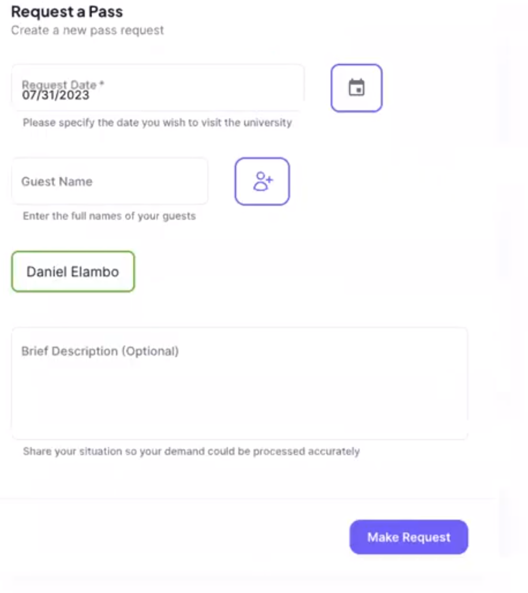

# Regular User manual

## Section overview

In this section you could find all the necessary information of how to use the ["IU Alumni"](https://github.com/TheSharpOwl/inno-alumni-portal) product from the student point of view. The following sub sections would describe feature presented in the application, how to use them and what for.

## Request pass tab

In the "Request pass" tab you can request an access to the university main building:

In order to make a request you need to provide the date of the visit and the list of guests (providing a full name for each guest individually). Additionally, you could leave the comments regarding the visitor if needed. The request is processed within 2 working days. The pass could be found at the reception desk of the university main building in case it was approved.

You could find the history of request at the bottom of the page. Here you could see the information about the requests including: the date of visit, the request status, its creation date and the detailed information about the request.

## Request elective tab

In this tab you could find the list of available elective courses. Each course has its name, instructor, and mode that could be Online, offline or hybrid. You could find extended information with the course description under "view" button near request button.

You could request the access to the course simply by clicking "Request" button at the course list or in detailed description.

At the bottom of the page you could find the list of all requested courses with the status of request. In case request was processed the feedback could be found in the detailed view.

## Make donations tab

In this page you could find all the necessary information regarding the donations to Innopolis University and how it would be used. Additionally, You could send a request with the donation number to specify how you what your donation to be used.

## Account tab

Account page provide the detailed information about you. This information includes:

- Your Full name
- Telegram alias (without @)
- Graduation Track (if any)
- Current City
- Phone Number
- Graduation year
- Current company and occupation
