# System administrator manual

## Overview

In this section you could find all the necessary information of how to use the ["IU Alumni"](https://github.com/TheSharpOwl/inno-alumni-portal) product from the administrators point of view. The following sub sections would describe feature presented in the application, how to use them and what for.

## Login

In order to login as an administrator you need to press "Admin Login" at the bottom of the page

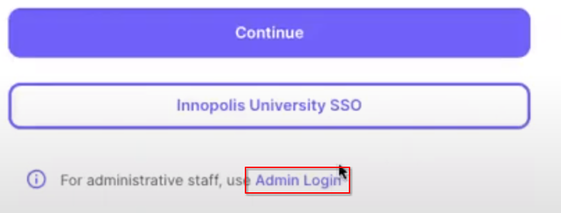

After that, "Admin login" page would appear

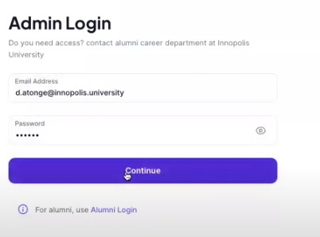

## Overview page

Here you could find all resent request that where send with ["IU Alumni"](https://github.com/TheSharpOwl/inno-alumni-portal) system.

## Pass Requests page

This is a page for where you could find all the main building access request from the students and process them.

In order to process a request press the "view" button at the end of request row

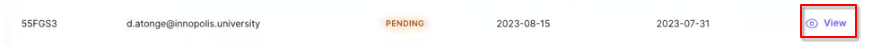

You will get a floating window with there request details. Here you could "approve" or "reject" the request. Additionally, you could leave feedback on your desertion for the student.

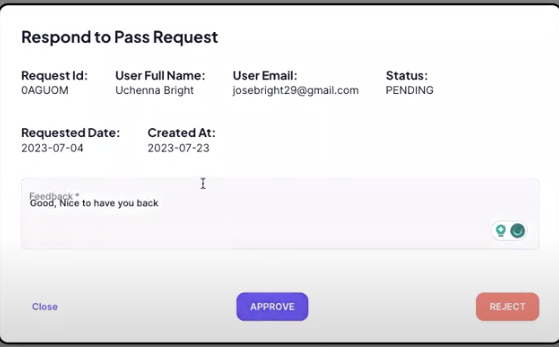

## Elective Requests page

This is a page for where you could find all the request to attend elective courses from the students and process them.

In order to process a request press the "view" button at the end of request row

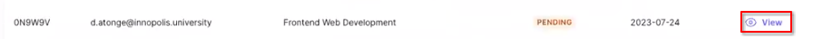

You will get a floating window with there request details. Here you could "approve" or "reject" the request. Additionally, you could leave feedback on your desertion for the student.

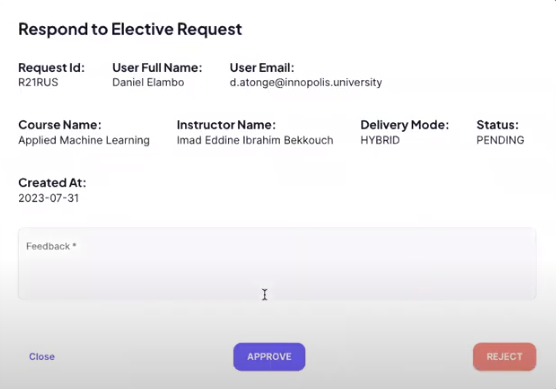

## Manage Elective Courses page

This is the page where all elective courses are displayed. As an administrator you could add, modify or delete and course.

### Course addition

In order to create new course press the add button at the top of course list

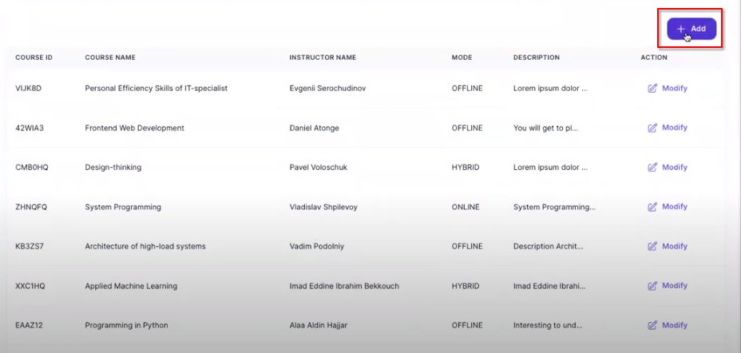

It will open a floating window where you need to provide:

- Course Title
- Instructor Name
- Mode (online, offline, hybrid)
- Description

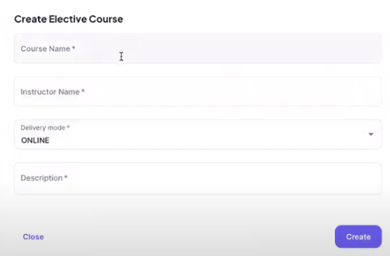

After all details are provided press "Create" button in order to add new course

### Course modification

In order to modify the course press "modify" button at the end of the row.

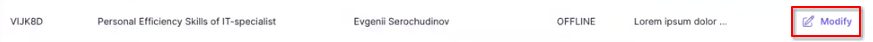

It will open a floating window which allows you to modify the course's:

- Title
- Instructor Name
- Mode (online, offline, hybrid)
- Description

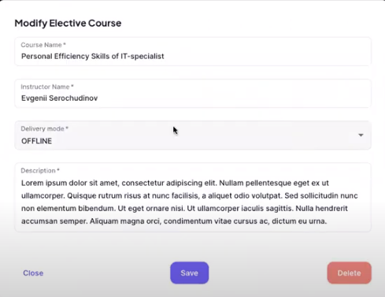

After you done with you modification press "Save" button to apply all changes

### Course deletion

In order to delete the course prosed to modification screen:

In the modification screen you could find the delete button.

### Course creation with Excel

You could create a group of courses with an Excel file. In order to do this create an excel file which contains **exactly one sheet (1 sheet)**. For proper work it should contain the following 4 headers:

- course_name - The name of the elective course
- instructor_name - The name of the instructor
- mode - OFFLINE/ONLINE/HYBRID
- description - The course description

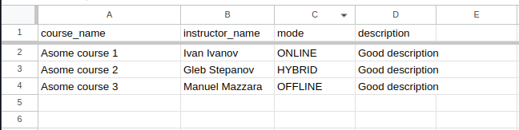

When the excel file was created you could add all the courses by simply Drag-n-drop the file to the to of the Manage Elective Courses page or by clicking Drag-n-drop zone.

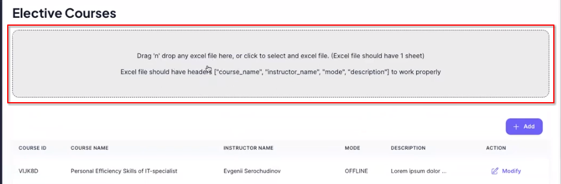

## Mange Donations page

In this page you can modify your reasoning for donation, and see all the request regarding them.

At the top of the pare you can find description section. It is a text editor that could be used to dynamically define why you need donations right now and this will be shown at the donation page of regular users.

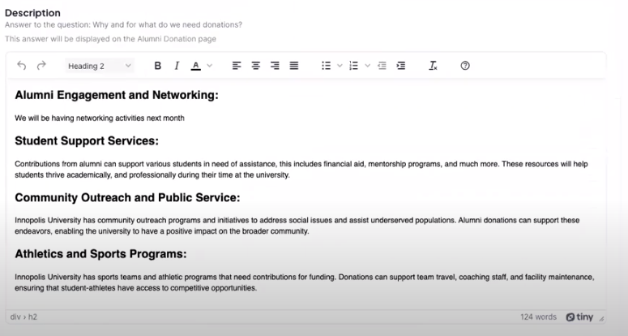

Lower on the same page you can find the list of request regarding donations. Each request contains the: user name, email, and donation message. You could download the list of the donation request at the top of the list.

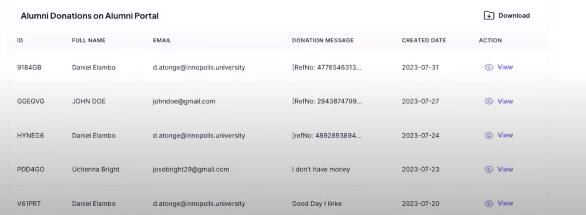

## Account page

At the account page administrator could find the list with all registered account and some statistics about them. 

Additionally, you can add new administrator account. To create new account press the button at the top of the page:

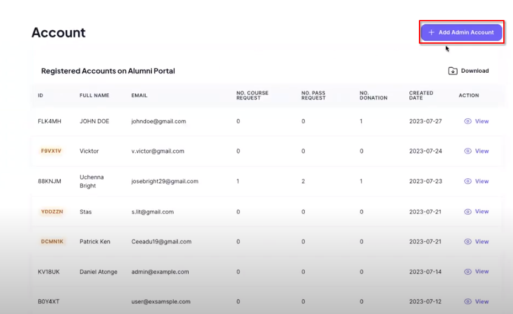

For the account you need to provide the administrator's:

- Full name
- Admin Email
- Password (could be generated automatically)

Be sure to save the administrator's email and password before creating account and share it only with responsible administraitor.
